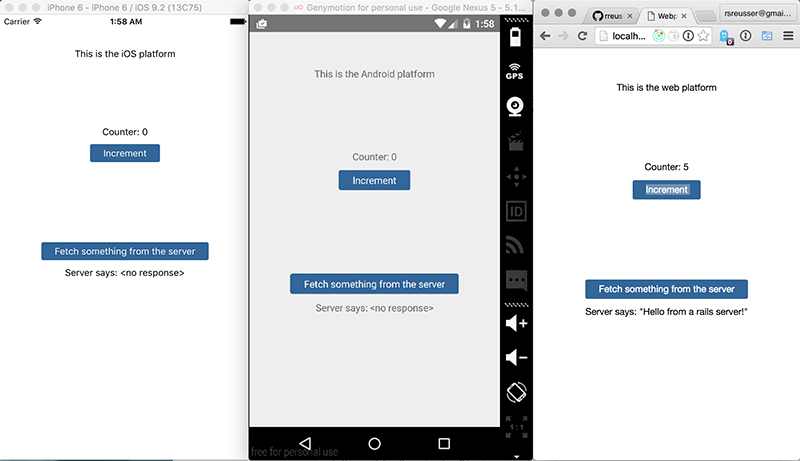

# react-native-with-everything

> Toward the dream of plugging all platforms into one app, finishing early, and spending more time outside.

[Click here for a live demo](http://rickyreusser.com/react-native-with-everything/) (not hooked up to an actual server. Also, check the js console to see our middleware logging strategy.)


[See the side-by-side view in animation form](./demo.gif)

## Overview

Nothing new new here. Just standing on the shoulders of giants and trying to plug the iOS, Android, and web platforms into one app. The react native docs are good to point out that they don't intend for all platforms to share an identical user interface, so note that it's trivial to swap components depending on the platform. The goal is a simple template that covers the basics like basic reducer structure, api and logging middleware, etc. I hope maybe something is useful. Take what you need!

- [react-native](facebook.github.io/react-native)
- [redux](https://github.com/rackt/redux)
- [redux-devtools](https://github.com/gaearon/redux-devtools) (time-travel debugging)
- [immutable.js](https://facebook.github.io/immutable-js/)
- [react-web](https://github.com/taobaofed/react-web) (see: [taobaofed/react-web#55](https://github.com/taobaofed/react-web/issues/55) for currently-unresolved issue)

## Installation

Requires npm v3. If you don't want to conflict with an existing npm v2 installation, try [npm3](https://www.npmjs.com/package/npm3). [linklocal](https://www.npmjs.com/package/linklocal) is used to avoid crazy relative paths. Just run it before `npm install` and it will create a symbolic link to `app/` in `node_modules`.

```
$ npm install -g linklocal
$ linklocal
$ npm3 install
```

## License

[WTFPL](http://www.wtfpl.net/)
